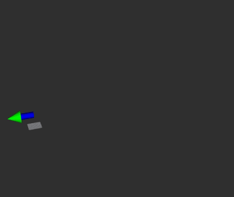

# Kalman Filter Localization  
  
Kalman Filter Localization  is a ros2 package of Kalman Filter Based Localization in 3D using GNSS/IMU/Odometry(Visual Odometry/Lidar Odometry).

## node
ekf_localization_node
- input  
/initial_pose (geometry_msgs/PoseStamed)   
/gnss_pose  (geometry_msgs/PoseStamed)   
/imu  (sensor_msgs/Imu)  
/odom (nav_msgs/Odometry)  
/tf(/base_link(robot frame) → /imu_link(imu frame))  
- output  
/curent_pose (geometry_msgs/PoseStamped)

## params

|Name|Type|Default value|Description|
|---|---|---|---|
|pub_period|int|10|publish period[ms]|
|var_gnss_xy|double|0.1|variance of a gnss receiver about position xy[m^2]|
|var_gnss_z|double|0.15|variance of a gnss receiver about position z[m^2]|
|var_odom_xyz|double|0.1|variance of an odometry[m^2]|
|var_imu_w|double|0.01|variance of an angular velocity sensor[(deg/sec)^2]|
|var_imu_acc|double|0.01|variance of an accelerometer[(m/sec^2)^2]|
|use_gnss|bool|true|whether gnss is used or not |
|use_odom|bool|false|whether odom(lo/vo) is used or not |

## demo

[rosbag demo data(ROS1)](https://drive.google.com/file/d/1CYuip5dApvcF-xrB2f5s8pdBu7MGCDxP/view)

```
rviz2 -d src/kalman_filter_localization/rviz/ekfl_demo.rviz
```

```
ros2 launch kalman_filter_localization ekf.launch.py
```

```
ros2 topic pub ekf_localization/initial_pose geometry_msgs/PoseStamped '{header: {stamp: {sec: 1532228824, nanosec: 55000000}, frame_id: "map"}, pose: {position: {x: 0, y: 0, z: 10}, orientation: {z: 1, w: 0}}}' --once
```

```
ros2 bag play -s rosbag_v2 test.bag
```


    
blue:initial pose, red:gnss pose, green: fusion pose

## references

- K Feng,"A New Quaternion-Based Kalman Filter",2017
- Joan Solà,"Quaternion kinematics for the error-state Kalman filter",2017
- Daniel Choukroun et al,"A Novel Quaternion Kalman Filter",2006
- An Improved EKF - The Error State Extended Kalman Filter
- Weikun Zhen, Sam Zeng, and Sebastian Scherer. "Robust Localization and Localizability Estimation with a Rotating Laser Scanner" , 2017.

